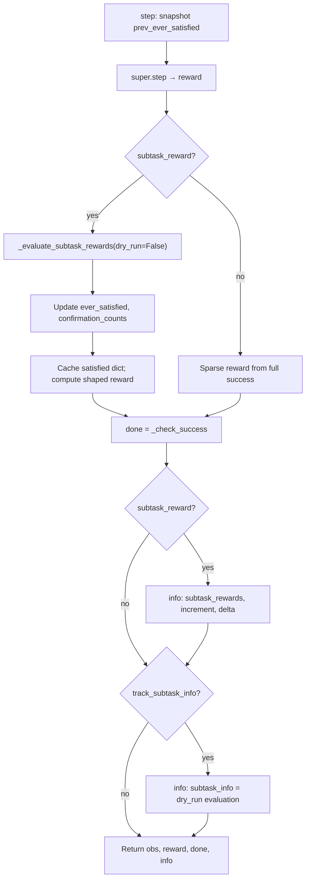

# Subtask pipeline and control flow

This document describes how LIBERO’s **`BDDLBaseDomain`** turns BDDL into per-step subtask evaluation, shaped rewards, and `info` diagnostics. For the **`info` dict contract** (key names, types, migration), see [SUBTASK_STEP_INFO.md](./SUBTASK_STEP_INFO.md).

---

## Overview

| Stage | Where | What happens |
|--------|--------|----------------|
| BDDL | Task `.bddl` files | Optional `(:subtask_rewards ...)` defines named subtasks, weights, `:after` ordering, and optional per-subtask confirmation. `(:goal ...)` defines full success (`done`). |
| Parse | `bddl_utils.robosuite_parse_problem`, `parse_subtask_rewards` | Builds `parsed_problem["subtask_rewards"]` (list or empty) and `parsed_problem["goal_state"]`. |
| Init | `BDDLBaseDomain.__init__` | `_normalize_subtask_weights()` scales fine-grained BDDL weights so they **sum to `subtask_reward_scale`**. |
| Reset | `_reset_internal` | Clears per-episode subtask state (ever-satisfied set, confirmation counters, satisfaction cache). |
| Each step | `step` → `reward` → `_evaluate_subtask_rewards` | Updates credit state, computes reward and optional `info` fields. |

**Modes**

- **Fine-grained**: `parsed_problem["subtask_rewards"]` is non-empty. Subtasks are evaluated in BDDL declaration order with **`:after`** prerequisite names (must have been **credited** at least once this episode).
- **Coarse**: no `(:subtask_rewards ...)`. Each flat predicate in `(:goal ...)` is an independent subtask with **equal** weight `subtask_reward_scale / N` (`N` = number of goal atoms).

---

## Per-episode state (source of truth in code)

These attributes on `BDDLBaseDomain` are cleared in `_reset_internal()` at the start of each episode:

| Attribute | Type | Purpose |
|-----------|------|---------|
| `_subtask_ever_satisfied` | `set` | Subtask **names** (fine) or `"_".join(pred)` **keys** (coarse) that have received **one-shot** credit this episode. Once added, they remain credited even if the predicate later becomes false (prevents reward cycling). |
| `_subtask_confirmation_counts` | `dict` | Consecutive-step counters for delayed **`on` / `in`** credit (and coarse `on`/`in`). |
| `_subtask_satisfied_cache` | `dict[str, bool]` | Result of the last `_evaluate_subtask_rewards(dry_run=False)` from inside `reward()`; copied into `info["subtask_rewards"]` in `step()` without re-evaluating. |

---

## Weight and reward calculation

### Normalization (init, fine mode only)

`_normalize_subtask_weights()` treats BDDL weights as **relative** positives, then scales each so the list sums to **`subtask_reward_scale`** (default `0.5`). See the docstring in `bddl_base_domain.py` for numeric examples.

### Per-step `reward()` when `subtask_reward=True`

1. Call `_evaluate_subtask_rewards()` (not dry run): may mutate `_subtask_ever_satisfied` and `_subtask_confirmation_counts`, and fills `_subtask_satisfied_cache`.
2. **Fine**: `r = sum(s["reward"] for s in fine if satisfied[s["name"]])` — weights are already scaled to sum to at most `subtask_reward_scale` across all subtasks if all were true.
3. **Coarse**: `r = subtask_reward_scale * (count of True in satisfied) / max(len(satisfied), 1)`.
4. If full goal satisfied (`_check_success()`): **`r += 1.0`** (terminal signal on top of subtask progress).
5. Multiply by `reward_scale` if set.

When `subtask_reward=False`, reward is sparse `0.0` / `1.0` from full success only (plus `reward_scale`).

---

## Predicate evaluation and gating

### `_subtask_candidate_valid`

Built on top of the raw predicate:

- Predicate must be **true**.
- For **`on` / `in`**: first argument’s object must **not** be in contact with the gripper (stable placement without “touching through” the check).
- For **`open` / `close` / `turnon` / `turnoff`**: same no-contact requirement on the relevant object argument.

If invalid, confirmation counters for that subtask are reset where applicable.

### Confirmation (`on` / `in`)

The candidate must be valid for **`subtask_confirmation_steps`** consecutive evaluations (default **10**), unless a fine-grained subtask specifies **`confirm_steps`** in BDDL. Only then is the subtask credited and added to `_subtask_ever_satisfied`.

---

## Fine-grained evaluation order (`_evaluate_subtask_rewards`)

1. Iterate subtasks **in BDDL order**.
2. If name already in **`local_ever`** (copy of `_subtask_ever_satisfied` plus intra-call credits): report `True`, skip predicate.
3. Else require every **`:after`** name to be in **`local_ever`**; otherwise `False` and reset that subtask’s confirmation counter.
4. If prerequisites met: evaluate predicate + `_subtask_candidate_valid`; update confirmation for `on`/`in`; on confirmed success, add name to `_subtask_ever_satisfied` (unless `dry_run=True`) and to **`local_ever`** so **dependent subtasks in the same `reward()` call** can unlock.

**`dry_run=True`** (used for `info["subtask_info"]` when `track_subtask_info=True`): evaluates predicates and returns a bool dict but **does not** write `_subtask_ever_satisfied` or persist confirmation counts from that call. See [SUBTASK_STEP_INFO.md](./SUBTASK_STEP_INFO.md) for interaction when both `subtask_reward` and `track_subtask_info` are enabled.

---

## `step()` ordering (why `info` matches `reward`)

1. `prev_ever_satisfied = set(_subtask_ever_satisfied)` if `subtask_reward`.
2. `obs, reward, done, info = super().step(action)` — robosuite calls **`reward()`** during this path, which runs `_evaluate_subtask_rewards()` and updates ever-satisfied.
3. `done = self._check_success()` (full goal only; not “last subtask only”).
4. If `subtask_reward`: fill `info["subtask_rewards"]` from `_subtask_satisfied_cache`; **`newly = _subtask_ever_satisfied - prev_ever_satisfied`**; build `subtask_reward_increment` and `subtask_reward_delta`.
5. If `track_subtask_info`: set `info["subtask_info"]` via `_evaluate_subtask_rewards(dry_run=True)`.

---

## Related files

| File | Role |
|------|------|
| `libero/libero/envs/bddl_base_domain.py` | `step`, `reward`, `_evaluate_subtask_rewards`, `_subtask_candidate_valid`, `_normalize_subtask_weights`, `_reset_internal` |
| `libero/libero/envs/bddl_utils.py` | `robosuite_parse_problem`, `parse_subtask_rewards` |
| `libero/libero/envs/SUBTASK_STEP_INFO.md` | Per-step `info` keys and migration from legacy `info["subtask_reward"]` |
| `libero/libero/envs/PREDICATE_LEVEL_EVALUATION.md` | L1/L2 localization–grasp predicates, L3 composition, L4 status |
| `libero/libero/benchmark/__init__.py`, `libero_suite_task_map.py` | Suite names (e.g. `libero_plus_train_subtasks`) mapping to tasks whose BDDL uses fine-grained subtasks |

---

## Downstream usage

Scripts or training code that log subtask progress should read **`subtask_reward_increment`** / **`subtask_reward_delta`** for **this-step** credit, and **`subtask_rewards`** for **cumulative** episode flags. Avoid using the key **`subtask_reward`** on `info` for a dict payload; see [SUBTASK_STEP_INFO.md](./SUBTASK_STEP_INFO.md).
